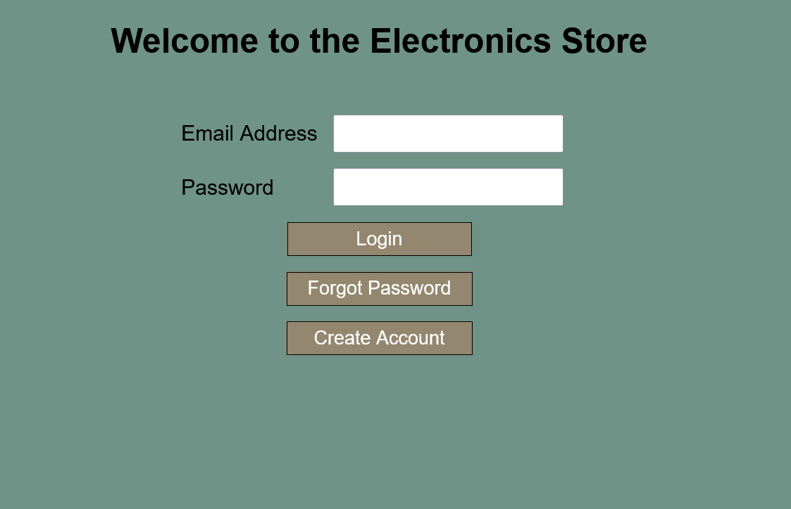
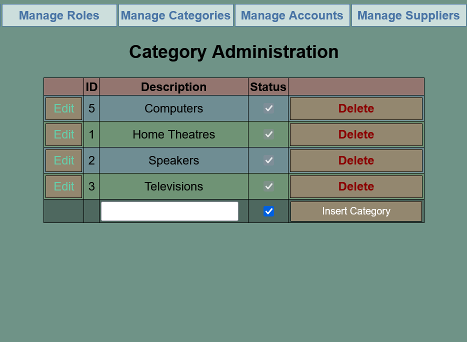
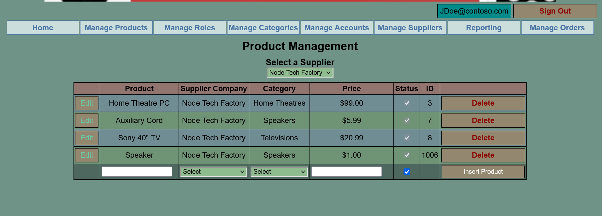
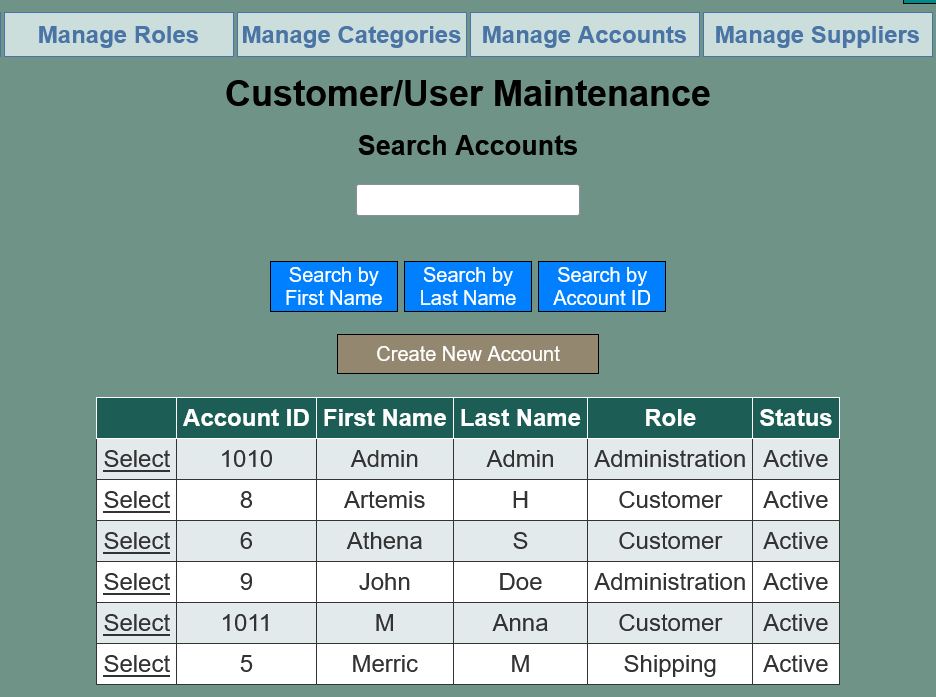
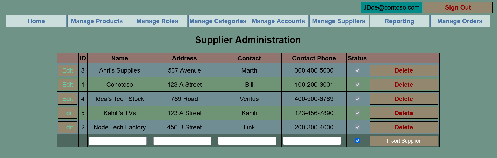
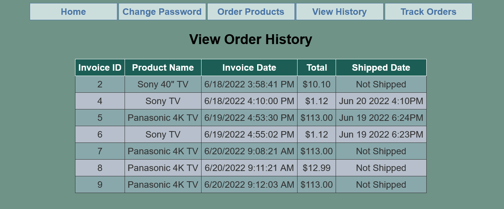
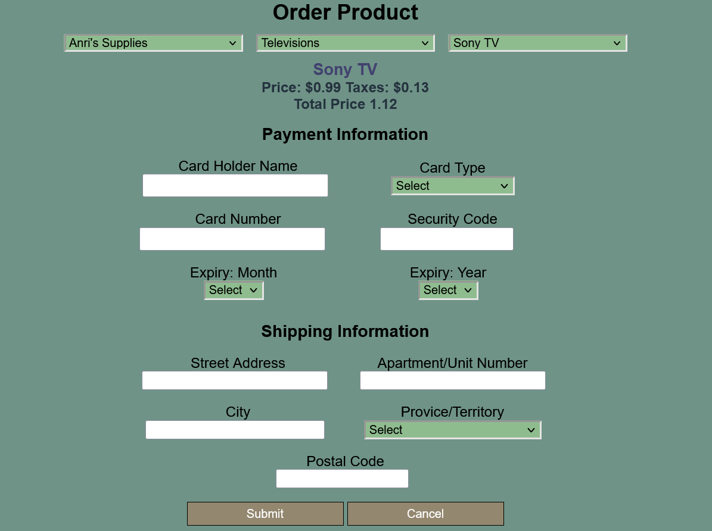
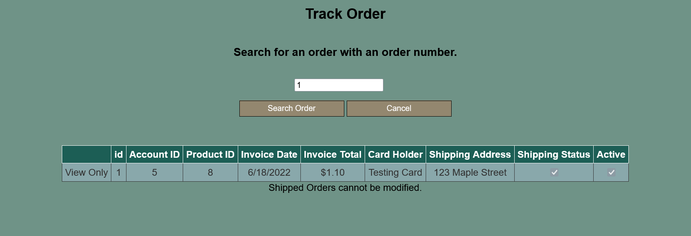
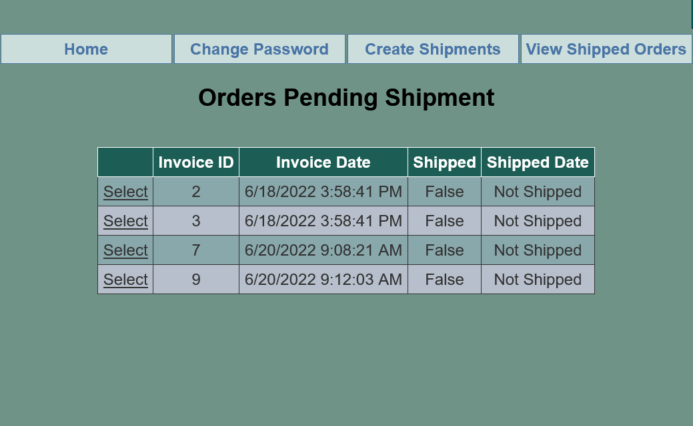

# Electronic Store CRM

### A CRM application where customers can make orders for various electronics. The application allows managing accounts, roles, products, 
categories, orders, tracking order history, viewing sales repors, and shipping orders. Check the screenshots below to see what it looks like!

There is a scripts sql file that will create the database, tables, and stored procedures. The application can also be run using Internet Information Services for Windows and SQL Server Express.

### Tech Stack

- ASP.NET
- C#
- Webforms
- SQL

### Application Walkthrough

#### Login Page for All Users

#### Registration for New Users

#### Manage Categories for Products

#### Manage Products Sold

#### Manage User Accounts

#### Manage Suppliers

#### View Order History

#### Order Products as a Customer

#### Track Orders previous made

#### Make Shipments as a Shipping User

### Project Goals

While this project will be my swan song for developing using .NET 4.7, I wanted to make a good final project. I continued to learn SQL and using .NET to interact with the database. I also implemented password hashing using a salt to make the SHA256 hash unique across all users.

I also aimed to continue the use of LINQ with the datasets returned from the SQL Server.

### Design

I broke the project out into several sections; one for each role. I then further broke it down into pages.

I kept the styles/color scheme the same for different roles for a consistent look and feel.

### Code Architecture & Solutioning

As I was building this project I found myself needing to use similar functions repeatedly, so I created static class with static methods that could be using throughout my app. This helped in reducing the lines of code written.

I made sure my methods were reusable so I could use them in various scenarios.

I also made sure the database tables were normalized to reduce data redundancy.

### Lessons Learned

I learned about password hashing with salts and how it adds complexity to improve security.

I'm starting to like Microsoft's documentation as there are a lot of examples and it explains how things work. It's probably the best resource for the Microsoft tech stack (.NET, ASP, SQL, PowerShell).

### What's Next?

On to .NET Core (as well as a modern version of SQL)
